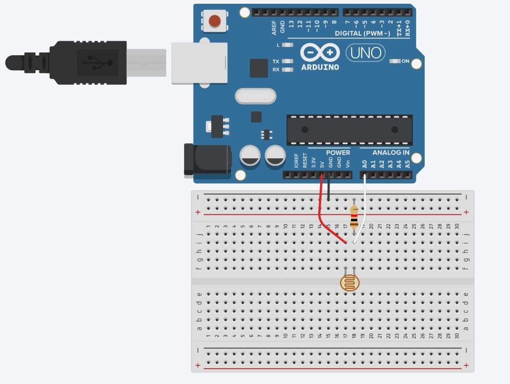

```c
#define led 7  
#define cds A0
void setup() {
  pinMode(led,OUTPUT);
  pinMode(cds,INPUT)
}

void loop() {
  if(analogRead(A0) > 700){
    digitalWrite(led, HIGH);
  }
  else{
    digitalWrite(led, LOW);
  }
}
```

`#define` -> 특정 값과 특정 이름을 연결시켜 준다고 생각하면 됩니다. led 는 7과 같습니다. cds는 A0와 같은 의미입니다.

`analogRead(A0)` -> A0는 아날로그 핀 입니다. A0핀에서0 ~ 1023 사이의 값을 받아옵니다.

`if` -> 만약에?

`else` -> 아니면?



