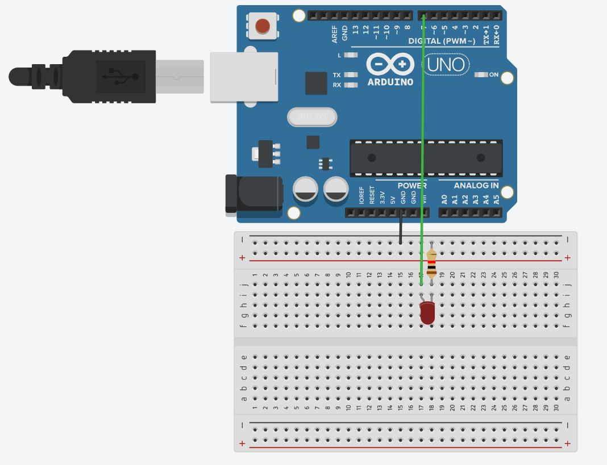

```c
const int led = 7;  
void setup() {
  
  pinMode(led,OUTPUT);
}

void loop() {
  digitalWrite(led, HIGH);
}
```

`setup` -> 프로그램이 실행되고 딱 한번 실행됩니다.

`loop` -> 프로그램이 실행되고 `setup`이 실행된 다음에 반복해서 실행됩니다.

`pinMode` -> 7번 핀을 출력하는데 사용한다고 정의합니다!

`digtialWrite` -> 7번핀을 HIGH(출력)상태로 만든다고 명령을 내립니다

`delay`-> `delay`는 동작을 지연 시킬 때 사용합니다! 위 프로그램에서 led를 키고 0.5 초 뒤 led를 끕니다. 이 동작을 계속 반복하게 됩니다 ㅎㅎ

`const` -> `const`는 상수형 변수를 만들 때 사용합니다. 상수는 변하지 않고 항상 일정한 값을 갖는 수를 말합니다. 

`int` -> int형 변수를 만들 때 사용합니다 (-2^31 ~ 2^31 -1)까지의 숫자를 담을 수 있습니다. led 라는 변수에는 7이라는 값이 들어 있습니다. 즉, led는 7번 핀을 가리키는 변수입니다.



