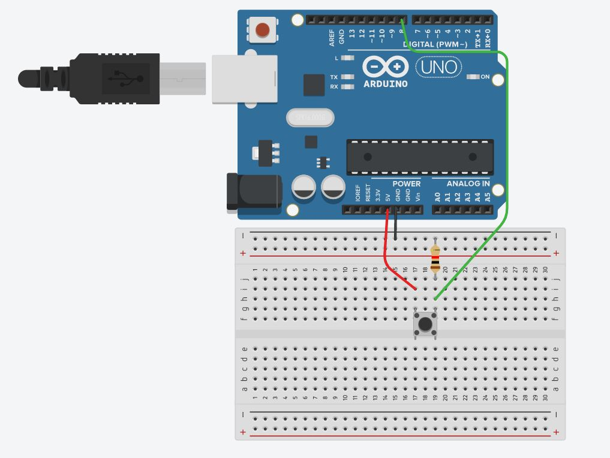

```c
const int led = 7;  
const int sw = 8;
void setup() {
  pinMode(sw, INPUT);
  pinMode(led,OUTPUT);
}

void loop() {
  if(digitalRead(sw) == HIGH){
    digitalWrite(led, HIGH);
  }
  else{
    digitalWrite(led, LOW);
  }
}
```

`digitalRead(sw)` -> sw는 8번 핀을 가리키고, 디지털 신호를 내보내고, 받는 핀 입니다. 8번 핀으로부터 디지털 신호(0 ~ 1) 를 받아옵니다.

`if` -> 만약에?

`else` -> 아니면?



