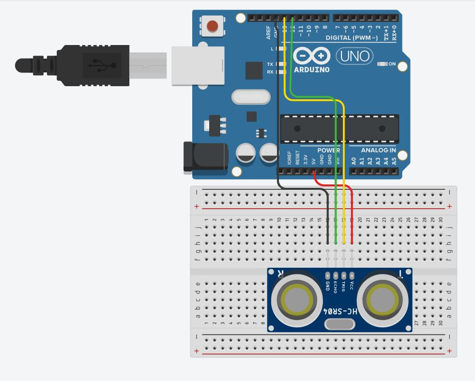

```c
int echoPin = 12;
int trigPin = 13;

void setup() {
  Serial.begin(9600);
  pinMode(trigPin, OUTPUT);
  pinMode(echoPin, INPUT);
}
void loop() {
    digitalWrite(trig, LOW);
    digitalWrite(echo, LOW);
    
    delayMicroseconds(2);
    digitalWrite(trig, HIGH);
    
    delayMicroseconds(10);
    digitalWrite(trig, LOW);

  

    unsigned long duration = pulseIn(echoPin, HIGH); 
  
    float distance = ((float)(340 * duration) / 10000) / 2;  
    //초음파 = 340m/s
  Serial.print(distance);
  Serial.println("cm");

  delay(500);
}
```

코드가 조금 복잡해 보입니다 ㅜㅜ

`Serial.begin(9600)` -> 아두이노는 시리얼 통신을 할 수 있습니다. 시리얼 통신은 아두이노의 센서값을 보고, 동작을 내릴 수 있는 기능을 할 수 있는 화면을 볼 수 있는 것 이라고 생각하시면 됩니다. 이 시리얼 통신을 9600bps의 속도로 실행합니다

`delayMicroseconds` -> `delay`를 주는 명령어 입니다. `delay`와 차이점은 마이크로초(백만분의 1)단위라는 것 입니다. 

`pulseIn` -> 초음파의 신호를 받을 때 사용하는 명령어라고 생각하시면 됩니다

`float` -> 실수형 변수를 정의할 때 사용합니다. 실수형 변수는 분수, 소수를 표현할 수 있는 변수라고 생각하시면 됩니다.

> 전체적인 코드를 정리해보도록 하겠습니다
>
> 처음에 trig, echo 핀을 모두 꺼둡니다.
>
> 2 마이크로 초 다음 trig 핀을 10 마이크로 초 동안 켜둡니다.( 이때 초음파가 나가게 됩니다 )
>
> 초음파가 돌아올 때 까지의 시간을 특정 공식을 이용해 정리합니다.
>
> 정리한 결과값을 시리얼 모니터를 통해 보여줍니다.



